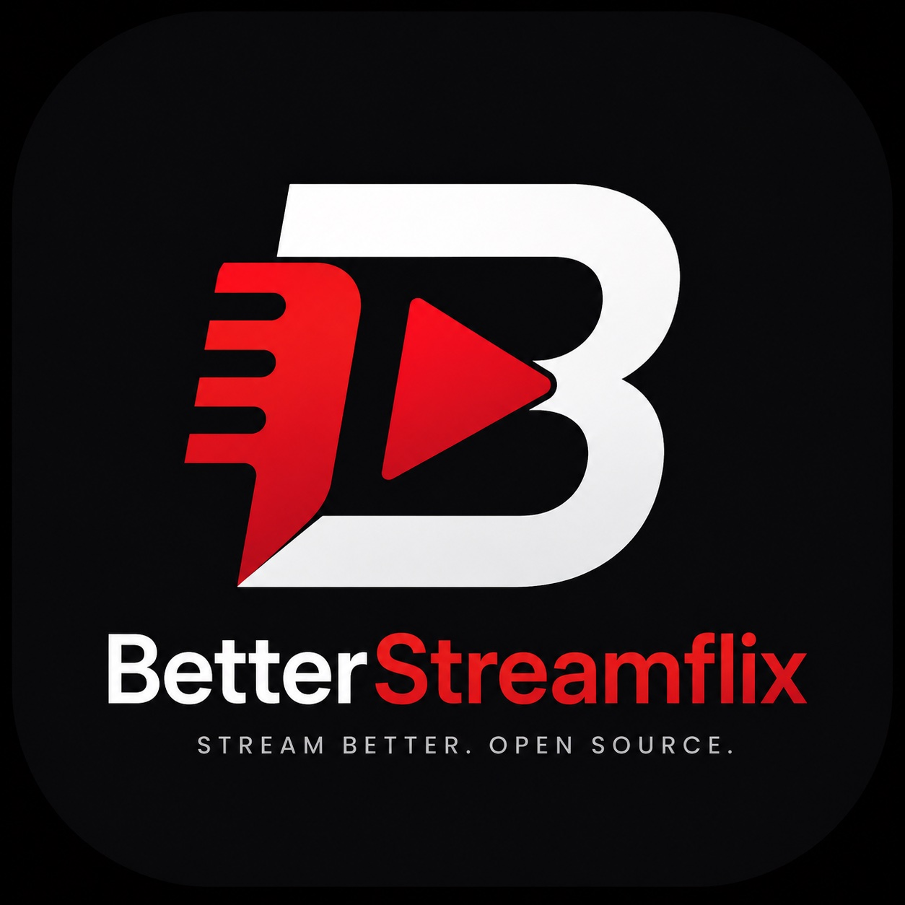

<p align="center">
  
</p>

<h1 align="center">BetterStreamflix for iOS</h1>

<p align="center">
  Native <strong>SwiftUI</strong> streaming client — cinematic TMDB discovery, Stremio community plugins, Debrid-first playback, and Liquid Glass chrome.
</p>

<p align="center">
  <a href="https://github.com/BetterStreamflix/BetterStreamflix-iOS/releases/latest"></a>
  <a href="https://github.com/BetterStreamflix/BetterStreamflix-iOS/actions/workflows/unsigned-ipa.yml"></a>
  <a href="LICENSE"></a>
  
  
  
  
  <a href="https://github.com/BetterStreamflix/BetterStreamflix-iOS/releases"></a>
</p>

<p align="center">
  <a href="#install--unsigned-ipa">Install</a> ·
  <a href="#features">Features</a> ·
  <a href="#stremio--debrid">Stremio &amp; Debrid</a> ·
  <a href="#check-for-updates">Updates</a> ·
  <a href="#support--community">Community</a> ·
  <a href="#credits">Credits</a>
</p>

---

## What is BetterStreamflix iOS?

**BetterStreamflix for iOS** is a native Apple client for browsing movies and series, managing your library, and playing streams through your own providers and Stremio addons. It is built entirely in SwiftUI for **iOS / iPadOS 18+**, with optional system Liquid Glass APIs when you build against a newer SDK.

The app does **not** host media. Catalog metadata and artwork come from **TMDB**. Playback comes from sources you configure — Core language scrapers, remote Stremio manifests, and optional **Debrid** services that turn magnet results into HTTP streams. Use it only for content you are legally authorized to access.

| | |
|---|---|
| **Bundle ID** | `com.betterstreamflix.ios` |
| **Current version** | **0.1.13** |
| **UI** | SwiftUI · Liquid Glass accents · dark cinematic chrome |
| **Player** | Native AVPlayer (HLS / MP4) · PiP · AirPlay |
| **Distribution** | Unsigned IPA via GitHub Actions + public update feed |

---

## Screenshots

> Device screenshots welcome — drop PNGs under `docs/screenshots/` and link them here.

| Home | Detail | Player | Stremio |
|------|--------|--------|--------|
| _Coming soon_ | _Coming soon_ | _Coming soon_ | _Coming soon_ |

Brand mark assets live in [`branding/`](branding/).

---

## Features

### Discovery & library
- **Home** — cinematic TMDB Featured hero, Liquid Glass action cluster, Continue Watching, Watchlist feedback, TMDB shelves, and glass Stremio shelves with **See all** + pin favorites
- **Movies / Series** — TMDB catalogs plus genre- and type-aware Stremio catalog shelves
- **Library** — Continue Watching, Watchlist, **custom Lists**, and Watched history
- **Search** — TMDB + Stremio catalogs with glass recent chips
- **Detail** — full-bleed hero, scroll-reveal sticky chrome with TMDB text logo, cast → person profiles, seasons/episodes, trailers, Add to list
- **Actor / Person** — Fans & Credits circles, scroll-reveal header

### Playback
- **NativePlayer** — AVPlayer HLS/MP4 with source & quality menu, double-tap ±10s, volume/brightness pans, glass controls, PiP / AirPlay
- Multi-addon **Stremio HTTP** streams plus **direct Debrid magnet → HTTP** (unrestrict chip) — no in-app BitTorrent
- Cached / seeder / release ranking, binge continuity, resolve HUD, Browse sources… filter sheet (sort + persist)
- Empty-state Safari / YouTube / MKV actions when a source cannot play natively
- Subtitles from Stremio addons and native providers (OpenSubtitles, SubDL, Wizdom, Ktuvit, and more)
- Playback language gating for Core scrapers; Stremio playback can run independently

### Stremio hub & More
- **Stremio hub** + Manage plugins + **Debrid** status strip
- Install-by-URL, deep-link install, Addon Store community catalogs, Configure WebView
- Install profiles, TorBox / Annatar / Jackettio / AIOStreams presets, update badges, session cache
- Token-free profile export, ShareLink, diagnostics, foreground health sweep
- Siri Shortcuts (hub / Debrid / plugins / Resume)
- Themes, backup/restore, Check for Updates, community CTAs

### Core providers
Language-aware Core scrapers (EN / DE / FR / ES / IT / PL and more) sit alongside Stremio. Built-in HTTP (`ExternalStreamAddonManifestURL`) stays under Core as **Built-in HTTP** — it is **not** listed as a Stremio plugin.

---

## Stremio & Debrid

**Plugins** = remote Stremio manifests (Cinemeta, TMDB Addon, OpenSubtitles, Torrentio / Comet / MediaFusion / AIOStreams / TorBox with Debrid, and community Addon Store entries).

**Debrid-first policy:** torrents become HTTP via addon manifests **or** optional direct Debrid API unrestrict (Real-Debrid, AllDebrid, Premiumize, TorBox). The app never runs BitTorrent itself.

Highlights in **0.1.13**:
- Validate tokens with premium badges, days/points strip, mismatch/unhealthy chips, expiry alerts, **Rebind**, auto-rebind
- Direct magnet → HTTP with hardened PM / AD / TorBox paths and soft-skip unreachable addons
- Prefer `[RD+]` / cached / healthy seeders / BluRay over CAM; quality / cached / addon filters
- Fast Cached / Quality install profiles; 6h foreground health sweep

---

## Install / unsigned IPA

### Download a release build

1. Open **[Releases](https://github.com/BetterStreamflix/BetterStreamflix-iOS/releases)** and download `BetterStreamflix-<version>-unsigned.ipa`, **or**
2. Open **[Actions → Unsigned IPA](https://github.com/BetterStreamflix/BetterStreamflix-iOS/actions/workflows/unsigned-ipa.yml)** and download the workflow artifact.

Sideload with your own signing flow (AltStore, Sideloadly, Xcode, TrollStore, etc.). The IPA is **unsigned** on purpose.

### Build from source (Xcode)

**Requirements:** macOS with Xcode 16.4+ (iOS 18 SDK; iOS 26 SDK enables system Liquid Glass APIs), iOS / iPadOS 18+, Apple Developer account for device installs. No third-party Swift packages.

1. Clone this repository and open `BetterStreamflix.xcodeproj`
2. Select the **BetterStreamflix** scheme and a simulator or device
3. Under **Signing & Capabilities**, choose your Team (change the bundle id if `com.betterstreamflix.ios` conflicts)
4. Press **Run**

### Build an unsigned IPA locally

```sh
./build-unsigned-ipa.sh 0.1.13
```

CI does the same on every push to `main` via [`.github/workflows/unsigned-ipa.yml`](.github/workflows/unsigned-ipa.yml): build → artifact → GitHub Release → update feeds.

---

## Check for Updates

In the app: **More → Check for updates** (also Settings → About).

The client fetches the **public** feed (no token in the app):

`https://raw.githubusercontent.com/BetterStreamflix/BetterStreamflix-update-feed/main/ios/latest.json`

It compares version/build and offers Download / up-to-date / retry. Release history lives in the same feed repo (`ios/releases.json`). CI also mirrors the payload into the private bookkeeping repo [BetterStreamflix-updates](https://github.com/BetterStreamflix/BetterStreamflix-updates).

---

## Support & community

- **Telegram** — https://t.me/BetterStreamflix  
- **Discord** — https://discord.gg/R4F72rMUZ8  
- **Patreon** — https://www.patreon.com/BetterStreamflix  
- **Buy Me a Coffee** — https://buymeacoffee.com/betterstreamflix  

Issues and discussions: use this GitHub repository.

---

## Credits

- **BetterStreamflix** — product, branding, Android lineage, and ongoing iOS maintenance by the BetterStreamflix project
- **iOS app lineage** — native SwiftUI codebase adapted from the public Streamflix-family work previously published as [rtk19/Vela](https://github.com/rtk19/Vela) (Apache License 2.0). Thanks to the original Vela / Streamflix contributors for the foundation this client builds on
- **TMDB** — this product uses the TMDB API but is not endorsed or certified by TMDB
- **Stremio addon authors & community** — optional remote manifests power catalogs, streams, and subtitles
- **Testers & supporters** — everyone who tries builds, reports issues, and backs the project

See [`NOTICE`](NOTICE) and [`LICENSE`](LICENSE) (Apache License 2.0) for attribution details.

---

## Legal

BetterStreamflix does not host, store, or redistribute media files. You are responsible for complying with local law and the terms of any services you connect. Metadata and artwork attribution belongs to TMDB and respective rights holders. Stremio, Debrid providers, and third-party addon names are trademarks of their owners.

---

## License

[Apache License 2.0](LICENSE)
